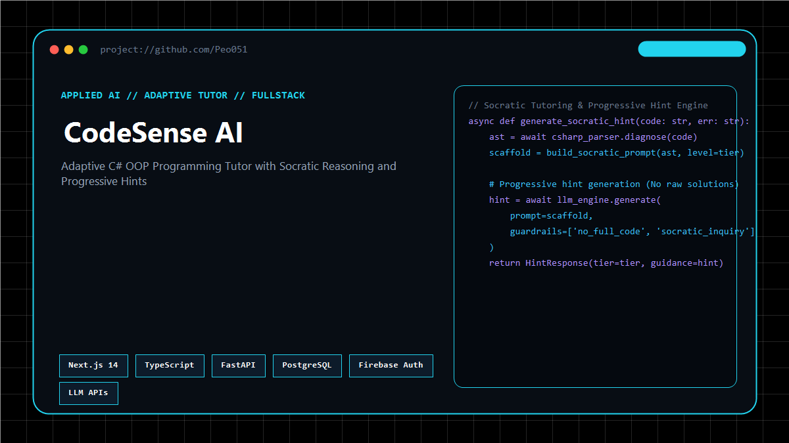
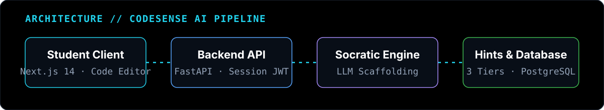
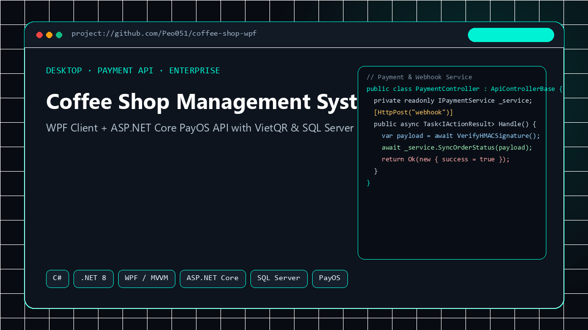
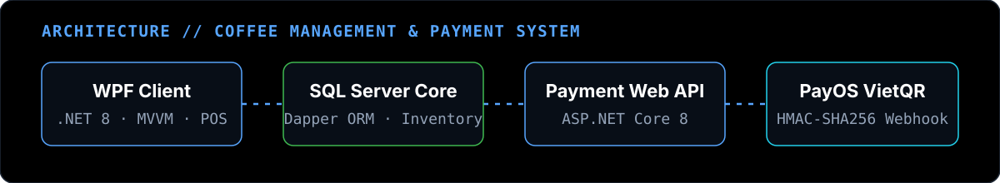
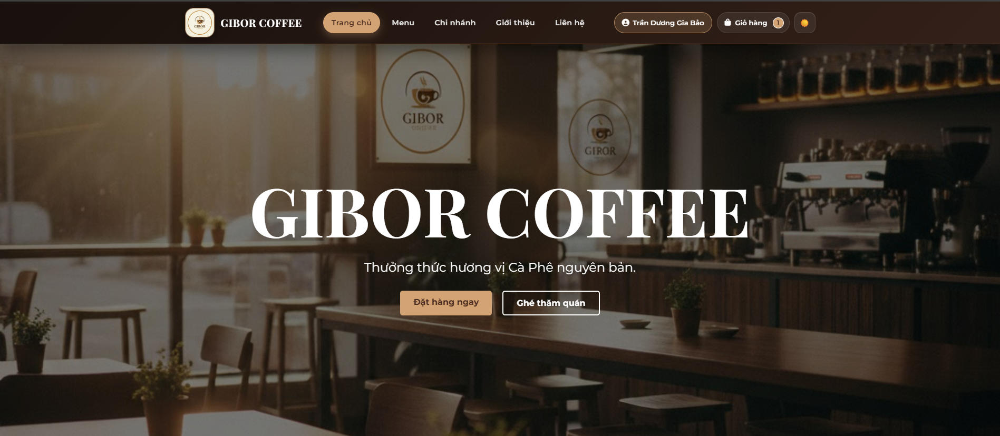
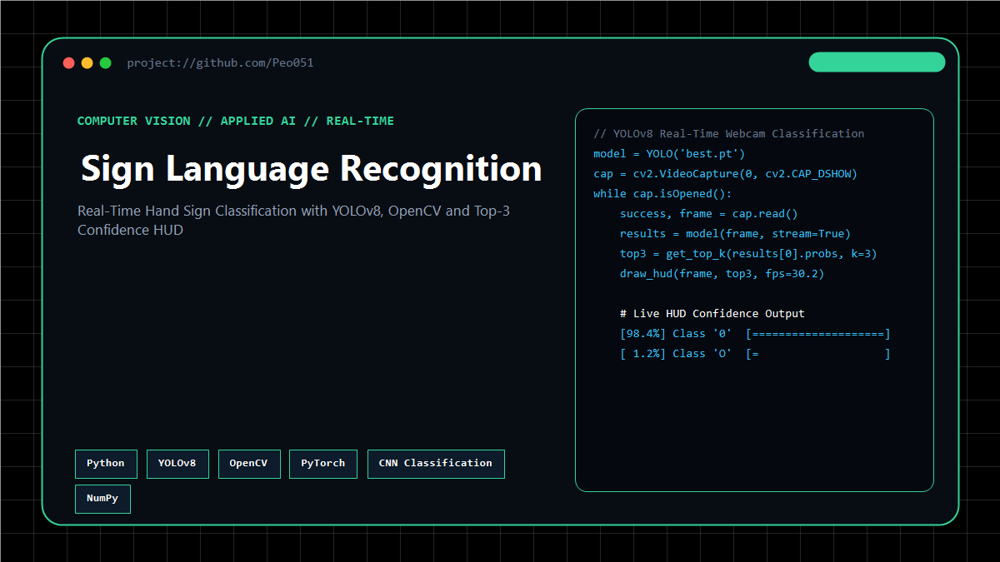
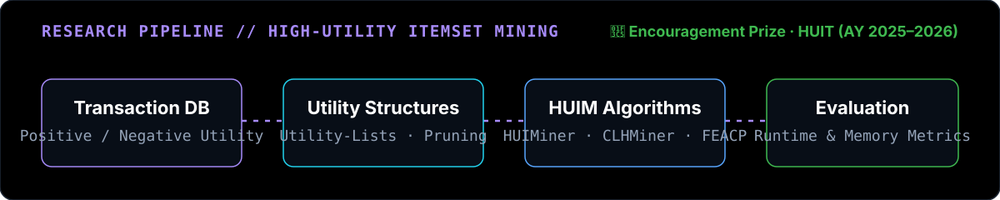
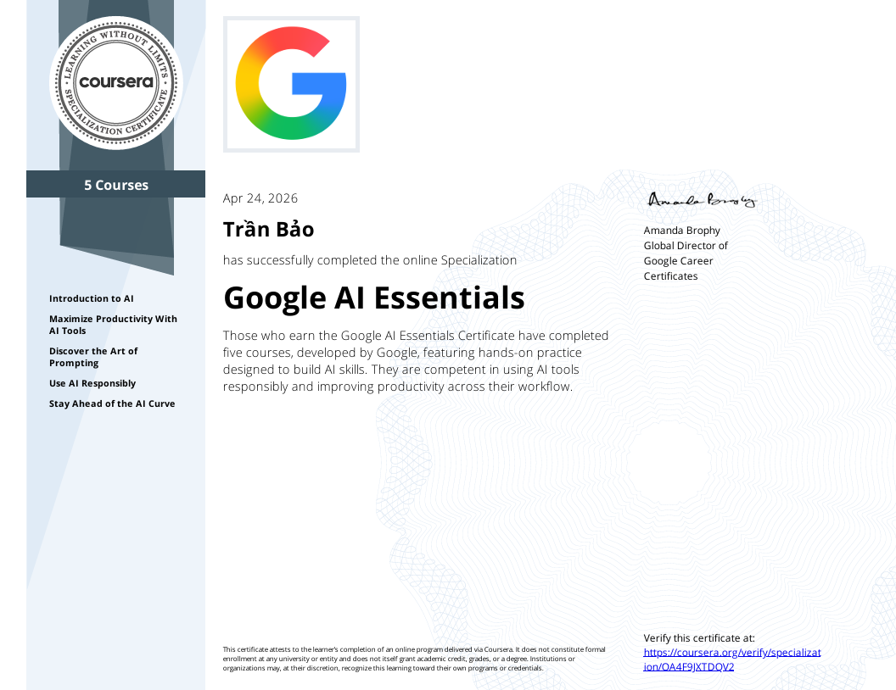
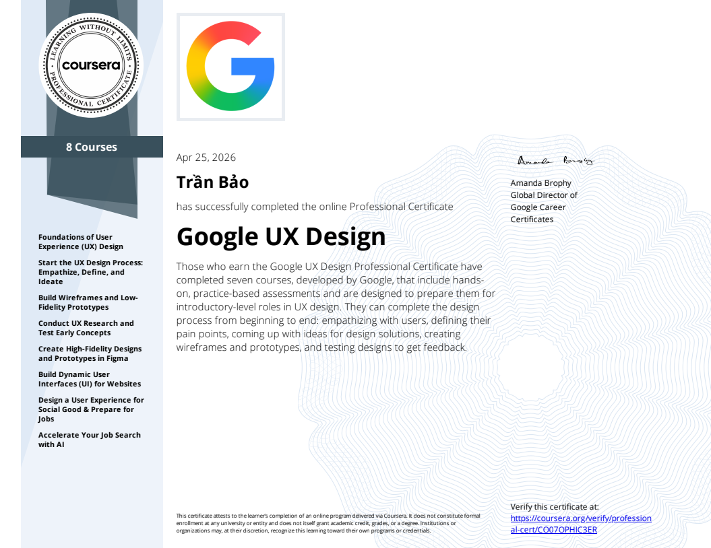
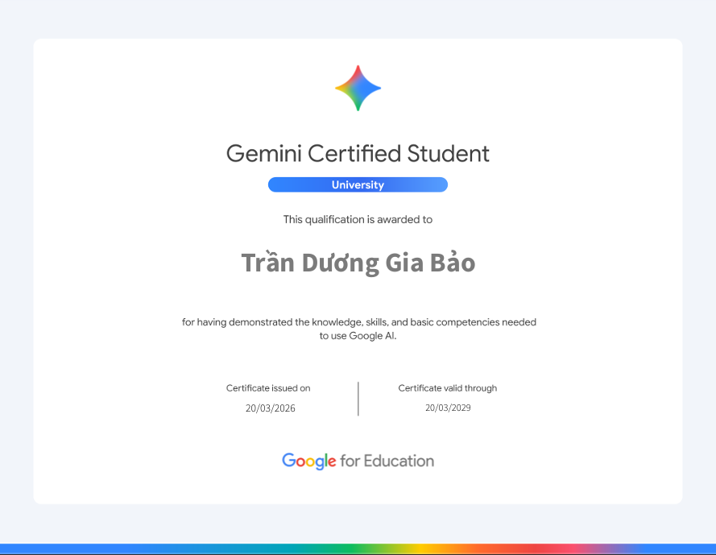

<p align="center">
  <picture>
    <source media="(prefers-color-scheme: dark)" srcset="./assets/brand/hero-dark.svg">
    <source media="(prefers-color-scheme: light)" srcset="./assets/brand/hero-light.svg">
    
  </picture>
</p>

<p align="center">
  <a href="https://peo051.github.io/portfolio/">
    
  </a>
  &nbsp;
  <a href="https://github.com/Peo051">
    
  </a>
  &nbsp;
  <a href="https://www.linkedin.com/in/tr%E1%BA%A7n-d%C6%B0%C6%A1ng-gia-b%E1%BA%A3o-951b10389">
    
  </a>
  &nbsp;
  <a href="mailto:tranduonggiabao0501email@gmail.com">
    
  </a>
</p>

<br/>

## 01 / ABOUT

Information Technology student at HUIT focused on building practical software systems with **.NET / C#** and exploring **applied AI** through full-stack projects and algorithmic research.

```
QUICK NAVIGATION:
[02 Featured Projects] · [03 Research Program] · [04 Core Technologies]
[06 Achievements]      · [07 Certifications]   · [08 Portfolio]
```

<br/>

## 02 / FEATURED PROJECTS

---

### 01 · CodeSense AI — Adaptive Programming Tutor

> An adaptive programming tutor for beginner C# OOP students, designed to provide progressive hints and guided reasoning instead of immediately revealing complete solutions.

<p align="center">
  
</p>

- **Status:** Core Architecture Implemented · Progressive Hint Engine in Development
- **Tech Stack:** `Next.js 14` · `TypeScript` · `FastAPI` · `PostgreSQL` · `Firebase Auth` · `LLM APIs`
- **What I Built:**
  - Next.js 14 frontend featuring code submission, interactive hint progression, and localized session caching.
  - FastAPI async backend service managing session state, input sanitization, and Firebase Auth JWT validation.
  - Socratic prompt orchestration pipeline translating C# compiler and runtime errors into 3-tier guided hints.
  - PostgreSQL relational schema via SQLAlchemy for student session history and data isolation.
- **Source:**
  - Repository: [Peo051/love-sense-ai](https://github.com/Peo051/love-sense-ai)
  - Legacy Prototype Demo: [love-sense-ai.vercel.app](https://love-sense-ai.vercel.app)

<details>
<summary>📐 <strong>View Architecture Pipeline</strong></summary>
<br/>
<p align="center">
  
</p>
</details>

<br/>

---

### 02 · Coffee Shop Management System — Desktop POS & Payment Service

> A dual-tier desktop POS and store management solution for coffee shops, featuring automated inventory deduction, staff shift reconciliation, and VietQR payment automation.

<p align="center">
  
</p>

- **Key Capabilities:** POS Quầy · Quản lý kho & Định lượng món · Khách hàng & Điểm tích lũy · Khuyến mãi linh hoạt · Đối soát ca làm việc · Thanh toán VietQR
- **Tech Stack:** `C#` · `.NET 8` · `WPF` · `MVVM` · `SQL Server` · `Dapper` · `ASP.NET Core 8` · `PayOS (VietQR)`
- **What I Built:**
  - WPF Desktop Client (.NET 8) implementing MVVM architecture with CommunityToolkit, decoupled Views, ViewModels, and Services.
  - High-performance data access layer using Dapper micro-ORM over SQL Server for order ledger and real-time inventory deduction.
  - Dedicated ASP.NET Core Web API integrating PayOS SDK for dynamic VietQR generation and webhook transaction callbacks.
  - Cryptographic HMAC-SHA256 signature verification ensuring reliable, tamper-proof payment synchronization.
- **Source:**
  - Repository: [Peo051/Coffee_Shop_Management_WPF](https://github.com/Peo051/Coffee_Shop_Management_WPF)

<details>
<summary>📐 <strong>View Architecture Pipeline</strong></summary>
<br/>
<p align="center">
  
</p>
</details>

<br/>

---

### 03 · Coffee Shop E-Commerce Platform — Customer Ordering Web App

> A customer-facing coffee ordering web application featuring a responsive product catalog, cart calculations, multi-provider authentication, and VietQR payment checkout.

<p align="center">
  
</p>

- **Key Capabilities:** Product Catalog & Category Filters · Real-time Cart · Order Checkout · Firebase Auth (Email, Google, GitHub) · VietQR Dynamic Payment · Order History
- **Tech Stack:** `HTML5` · `CSS3` · `JavaScript` · `Bootstrap 5` · `Firebase Auth` · `PayOS`
- **My Contribution:**
  - Structured responsive frontend layout across desktop and mobile screens for home, menu, and checkout views.
  - Cart calculation engine, coupon discount processing, and checkout state transitions.
  - Firebase Authentication integration supporting Email/Password, Google OAuth, and GitHub OAuth logins.
  - PayOS banking payment flow integration with dynamic QR display and transaction confirmation handling.
- **Source:**
  - Repository: [Peo051/Coffee_Shop_Management_Web](https://github.com/Peo051/Coffee_Shop_Management_Web)

<br/>

---

### 04 · Real-Time Sign Language Recognition — Computer Vision

> A real-time hand sign classification application leveraging YOLOv8 and OpenCV to recognize sign language digits from live webcam video feeds.

<p align="center">
  
</p>

- **Key Capabilities:** Real-time webcam inference · Top-3 predictions with confidence bars · Real-time FPS overlay · Hand placement guide frame · Low-confidence alert
- **Tech Stack:** `Python` · `YOLOv8 (Ultralytics)` · `OpenCV` · `PyTorch` · `NumPy`
- **What I Built:**
  - Training and inference workflow utilizing YOLOv8 classification (`yolov8n-cls`) on hand sign gesture datasets.
  - Real-time webcam capture loop with OpenCV, frame pre-processing, and dynamic HUD overlay.
  - Top-3 class probability sorting, threshold confidence filtering, and snapshot capture mechanism.
- **Source:**
  - Repository: [Peo051/YOLOv8_Detect_SignLanguage](https://github.com/Peo051/YOLOv8_Detect_SignLanguage)

<br/>

## 03 / RESEARCH

### HUIM Research Program — High-Utility Itemset Mining

Research implementations for High-Utility Itemset Mining on transaction databases containing both positive and negative unit profits, with experiments focused on execution runtime and memory consumption.

<p align="center">
  
</p>

- **Research Topic:** *"Optimizing Time in Mining High Utility Itemsets on Positive and Negative Profit Transaction Databases"*
- **Recognition:** 🏅 **Encouragement Prize** — Student Research Competition (Faculty of IT, HUIT, AY 2025–2026)
- **Authors:** Trần Dương Gia Bảo, Trần Gia Bảo
- **Advisors:** ThS. Vũ Văn Vinh, HV. Phạm Tấn Thuận (April 2026)
- **Core Algorithms Implemented:**
  - `HUIMiner`: Baseline utility-list mining extended to handle transactions with positive and negative unit profits.
  - `CLHMiner`: Cross-level high-utility itemset mining algorithm incorporating taxonomic abstraction trees.
  - `FEACP`: Fast and efficient algorithmic variant incorporating tighter candidate pruning strategies.
  - Empirical benchmarking harness measuring CPU runtime and memory consumption across varying `minUtil` thresholds.
- **Repositories:**
  - [Peo051/HUIMiner](https://github.com/Peo051/HUIMiner)
  - [Peo051/CLHMiner](https://github.com/Peo051/CLHMiner)
  - [Peo051/FEACP](https://github.com/Peo051/FEACP)

<br/>

## 04 / CORE TECHNOLOGIES

| Area | Technologies | Practical Application |
| :--- | :--- | :--- |
| **Core Systems** | `C#` · `.NET 8` · `ASP.NET Core` · `SQL Server` · `PostgreSQL` | Desktop POS, REST APIs, MVVM architecture, Dapper micro-ORM, relational schemas |
| **Web & Fullstack** | `Next.js 14` · `TypeScript` · `FastAPI` · `Bootstrap 5` · `Firebase Auth` | Responsive client applications, async request handlers, JWT authentication |
| **Applied AI** | `LLM Prompt Scaffolding` · `YOLOv8` · `OpenCV` · `AI Evaluation` | Adaptive tutoring workflows, real-time computer vision classification |
| **Research & Algorithms** | `Java` · `High-Utility Mining (HUIM)` · `Utility-Lists` | Search-space pruning, taxonomy trees, empirical runtime and memory profiling |
| **Currently Learning** | `ASP.NET Core Microservices` · `System Design` · `LLM Benchmarks` | Scalable backend architectures, service communication, data pipelines |

<br/>

## 05 / LIVE GITHUB METRICS

> Live telemetry rendered automatically via GitHub Actions from GitHub GraphQL/REST APIs.

<p align="center">
  
</p>

<br/>

## 06 / ACHIEVEMENTS

Verified academic milestones in student scientific research, database design, and competitive data science:

<details open>
<summary><strong>🏅 Student Research Competition — HUIT (AY 2025–2026) · Encouragement Prize</strong></summary>
<br/>

<p align="center">
  
</p>

- **Topic:** *"Optimizing Time in Mining High Utility Itemsets on Positive and Negative Profit Transaction Databases"*
- **Organized by:** Faculty of Information Technology, University of Industry and Trade (HUIT)
- **Source Code:** [HUIMiner](https://github.com/Peo051/HUIMiner) · [CLHMiner](https://github.com/Peo051/CLHMiner) · [FEACP](https://github.com/Peo051/FEACP)

<details>
<summary>&nbsp;&nbsp;&nbsp;&nbsp;📄 View Participation Certificate</summary>
<br/>
<p align="center">
  
</p>
</details>
</details>

<br/>

<details>
<summary><strong>🏅 Database Design Challenge — HUIT (AY 2025–2026) · Encouragement Prize</strong></summary>
<br/>

<p align="center">
  
</p>

- Organized by the Faculty of Information Technology, HUIT. Recognized for relational schema normalization, integrity constraints, and query design quality.
</details>

<br/>

<details>
<summary><strong>🎯 Data Science Competition — University Level (Final Round)</strong></summary>
<br/>

<table>
  <tr>
    <td align="center" width="50%">
      <strong>Rice Pest Detection &amp; Segmentation</strong><br/>
      <sub>YOLO + SAM-ViT</sub><br/><br/>
      
    </td>
    <td align="center" width="50%">
      <strong>Skin Lesion Classification</strong><br/>
      <sub>Vision Transformer (ViT)</sub><br/><br/>
      
    </td>
  </tr>
</table>

- Reached the university-level final round across applied computer vision and medical image classification tracks.
</details>

<br/>

## 07 / SELECTED CERTIFICATIONS

A curated showcase of verified technical certifications from Google:

<table>
  <tr>
    <td align="center" width="50%" valign="top">
      <br/>
      <strong>Google AI Professional Certificate</strong><br/>
      <sub>Google via Coursera · 2026</sub><br/>
      <a href="https://coursera.org/verify/professional-cert/9477BZVHLC2N"><strong>Verify Credential →</strong></a>
    </td>
    <td align="center" width="50%" valign="top">
      <br/>
      <strong>Google AI Essentials Specialization</strong><br/>
      <sub>Google via Coursera · 2026</sub><br/>
      <a href="https://coursera.org/verify/specialization/OA4F9JXTDQV2"><strong>Verify Credential →</strong></a>
    </td>
  </tr>
  <tr>
    <td align="center" width="50%" valign="top">
      <br/>
      <strong>Google UX Design Professional Certificate</strong><br/>
      <sub>Google via Coursera · 2026</sub><br/>
      <a href="https://coursera.org/verify/professional-cert/CO07OPHIC3ER"><strong>Verify Credential →</strong></a>
    </td>
    <td align="center" width="50%" valign="top">
      <br/>
      <strong>Google Prompting Essentials</strong><br/>
      <sub>Google via Coursera · 2026</sub><br/>
      <a href="https://coursera.org/verify/95K4US2N6RI4"><strong>Verify Credential →</strong></a>
    </td>
  </tr>
  <tr>
    <td align="center" width="50%" valign="top">
      <br/>
      <strong>Gemini Certified: University Student</strong><br/>
      <sub>Google for Education · 2026</sub><br/>
      <sub>Verified Academic Credential</sub>
    </td>
    <td align="center" width="50%" valign="top">
      <br/>
      <strong>Accelerate Your Job Search with AI</strong><br/>
      <sub>Google via Coursera · 2026</sub><br/>
      <a href="https://coursera.org/verify/specialization/DM1GGN4MS6QE"><strong>Verify Credential →</strong></a>
    </td>
  </tr>
</table>

<p align="right">
  <a href="https://peo051.github.io/portfolio/"><strong>View all certificates &amp; sub-courses in Portfolio →</strong></a>
</p>

<br/>

## 08 / PORTFOLIO

A dedicated bilingual personal portfolio featuring live projects, interactive demos, research papers, verified certificates, and downloadable CV:

<p align="center">
  <a href="https://peo051.github.io/portfolio/">
    
  </a>
  <br/><br/>
  <sub>URL: <a href="https://peo051.github.io/portfolio/">https://peo051.github.io/portfolio/</a> · Source: <a href="https://github.com/Peo051/portfolio">github.com/Peo051/portfolio</a></sub>
</p>

<br/>

## 09 / ACTIVITY

> 12-week contribution pulse computed from public repository commits and events.

<p align="center">
  
</p>

<br/>

## 10 / CONTACT

Feel free to connect for software engineering internship opportunities, research collaborations, or technical discussions:

- **Email:** [tranduonggiabao0501email@gmail.com](mailto:tranduonggiabao0501email@gmail.com)
- **LinkedIn:** [Trần Dương Gia Bảo](https://www.linkedin.com/in/tr%E1%BA%A7n-d%C6%B0%C6%A1ng-gia-b%E1%BA%A3o-951b10389)
- **Portfolio:** [peo051.github.io/portfolio](https://peo051.github.io/portfolio/)
- **GitHub:** [github.com/Peo051](https://github.com/Peo051)
- **Location:** Ho Chi Minh City, Vietnam
