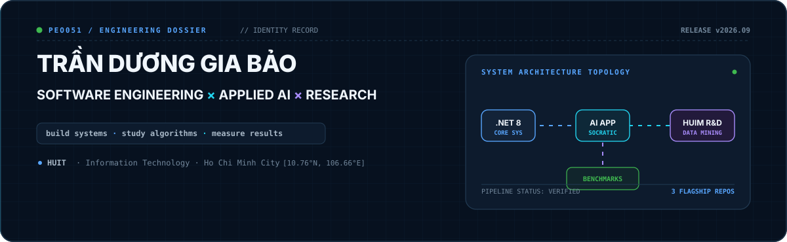
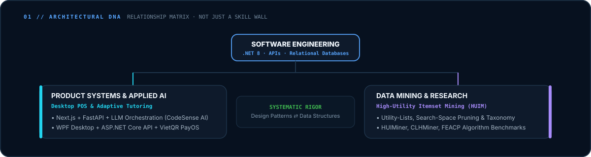
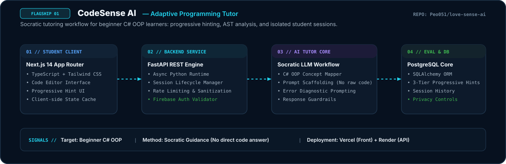
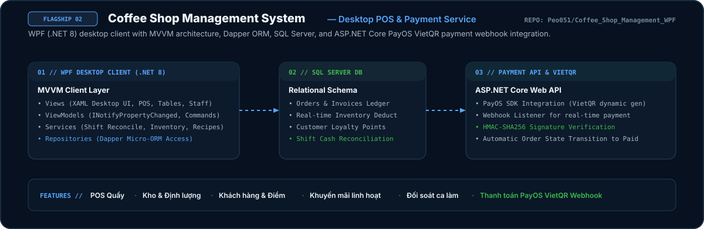
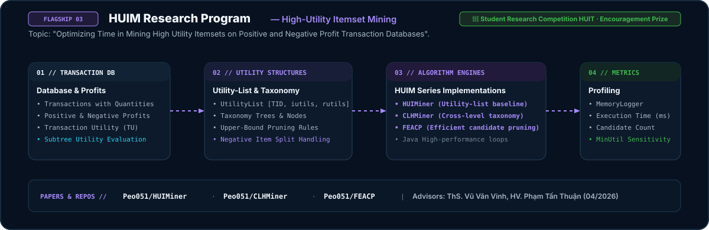
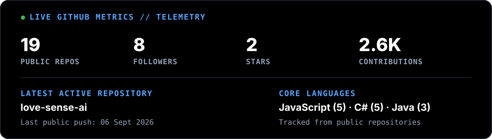
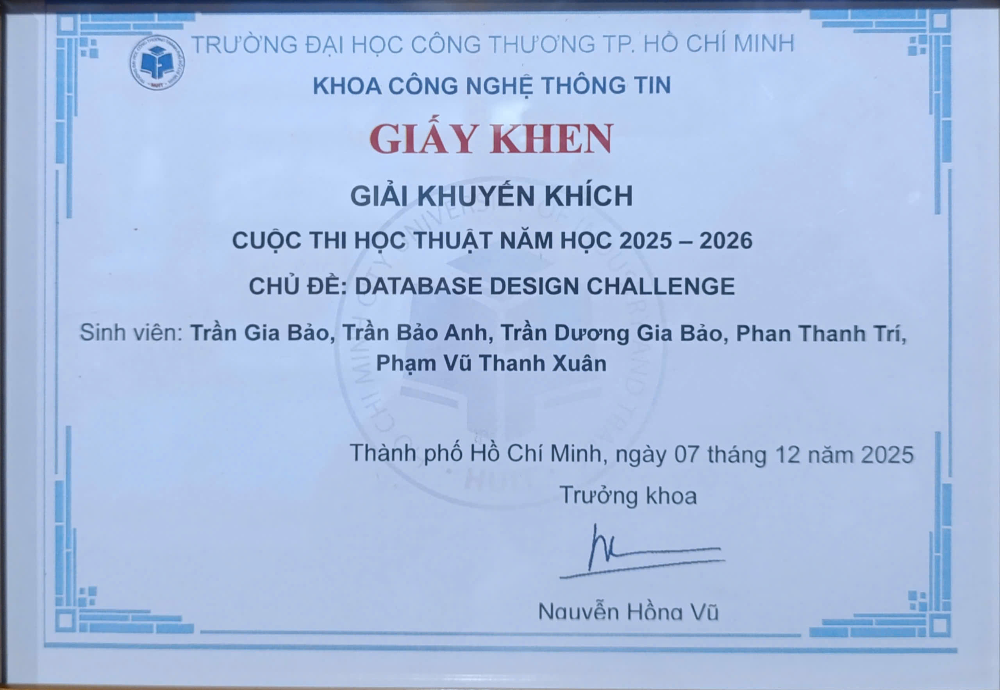
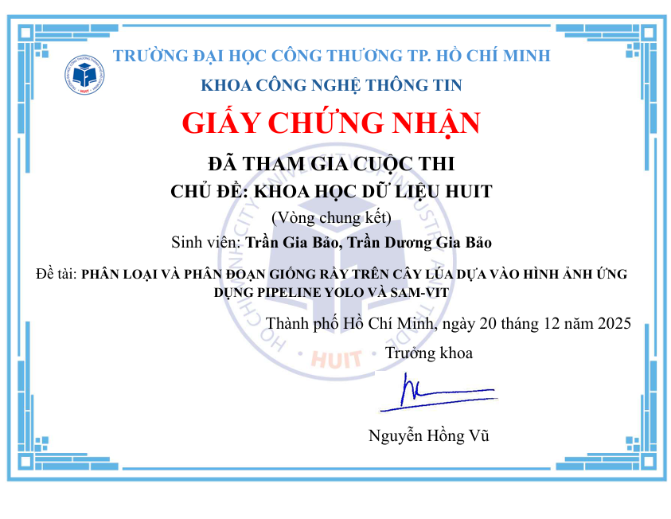
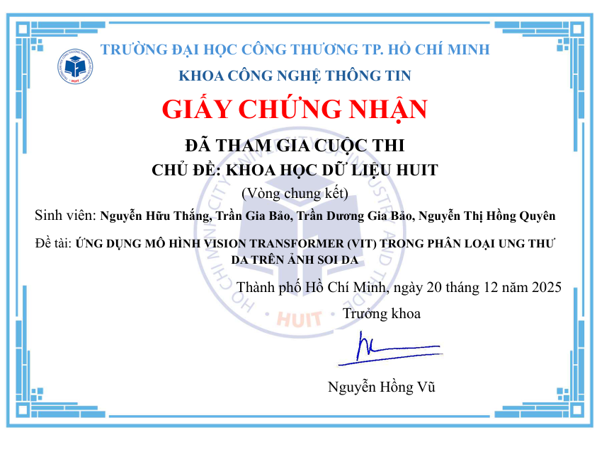
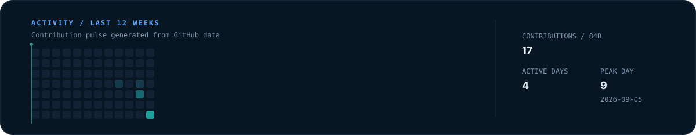

<p align="center">
  <picture>
    <source media="(prefers-color-scheme: dark)" srcset="./assets/brand/hero-dark.svg">
    <source media="(prefers-color-scheme: light)" srcset="./assets/brand/hero-light.svg">
    
  </picture>
</p>

<p align="center">
  <a href="mailto:tranduonggiabao0501email@gmail.com">
    
  </a>
  &nbsp;
  <a href="https://www.linkedin.com/in/tr%E1%BA%A7n-d%C6%B0%C6%A1ng-gia-b%E1%BA%A3o-951b10389">
    
  </a>
  &nbsp;
  <a href="https://github.com/Peo051">
    
  </a>
  &nbsp;
  
</p>

<br/>

## 01 / ENGINEERING DNA

> Architectural mapping illustrating cross-discipline synthesis between core software engineering, applied AI systems, and algorithmic research.

<p align="center">
  <picture>
    <source media="(prefers-color-scheme: dark)" srcset="./assets/diagrams/engineering-dna-dark.svg">
    <source media="(prefers-color-scheme: light)" srcset="./assets/diagrams/engineering-dna-light.svg">
    
  </picture>
</p>

<br/>

## 02 / SELECTED SYSTEMS

### 01 · CodeSense AI — Adaptive Programming Tutor

<p align="center">
  <picture>
    <source media="(prefers-color-scheme: dark)" srcset="./assets/projects/codesense-ai-dark.svg">
    <source media="(prefers-color-scheme: light)" srcset="./assets/projects/codesense-ai-light.svg">
    
  </picture>
</p>

- **What is it?** An adaptive programming tutor designed for beginner C# Object-Oriented Programming (OOP) learners, delivering progressive hints and Socratic guidance rather than giving away raw solutions.
- **Why is it technically interesting?** Combines decoupled full-stack architecture with LLM prompt scaffolding. It translates student code and error logs into pedagogical guidance across three hint tiers, maintaining isolated student session context with privacy-first data boundaries.
- **What did I implement?**
  - Next.js 14 frontend with interactive code editor, real-time hint progression, and localized state cache.
  - FastAPI async backend service managing session state, sanitization, and Firebase Auth JWT verification.
  - Socratic prompt orchestration pipeline interfacing with LLM APIs for C# OOP concept diagnostics.
  - PostgreSQL schema via SQLAlchemy for session history, telemetry, and data privacy controls.
- **Source & Live Deployment:**
  - Repository: [Peo051/love-sense-ai](https://github.com/Peo051/love-sense-ai)
  - Live Demo: [love-sense-ai.vercel.app](https://love-sense-ai.vercel.app) · API Docs: [love-sense-ai.onrender.com/docs](https://love-sense-ai.onrender.com/docs)

<br/>

### 02 · Coffee Shop Management System — Desktop POS & Payment API

<p align="center">
  <picture>
    <source media="(prefers-color-scheme: dark)" srcset="./assets/projects/coffee-system-dark.svg">
    <source media="(prefers-color-scheme: light)" srcset="./assets/projects/coffee-system-light.svg">
    
  </picture>
</p>

- **What is it?** A multi-tier retail management desktop application for coffee shop operations, featuring real-time POS ordering, automated inventory deduction, staff shift reconciliation, and VietQR payment processing.
- **Why is it technically interesting?** Decouples desktop desktop client operations (WPF MVVM + Dapper) from payment lifecycle management (ASP.NET Core Web API). Uses cryptographic HMAC-SHA256 signature verification to securely process PayOS VietQR payment webhooks without exposing private banking credentials to the POS client.
- **What did I implement?**
  - WPF Desktop Client (.NET 8) following MVVM design pattern with CommunityToolkit, custom data binding, and responsive views.
  - High-performance data access layer using Dapper micro-ORM over SQL Server for order processing and inventory ledgers.
  - Dedicated ASP.NET Core 8 Web API integrating PayOS SDK for dynamic VietQR generation and webhook transaction callbacks.
  - Automated business rules for stock deduction, tiered promotions, customer loyalty points, and end-of-shift cash balancing.
- **Source:**
  - Repository: [Peo051/Coffee_Shop_Management_WPF](https://github.com/Peo051/Coffee_Shop_Management_WPF)

<br/>

### 03 · HUIM Research Program — High-Utility Itemset Mining

<p align="center">
  <picture>
    <source media="(prefers-color-scheme: dark)" srcset="./assets/projects/huim-research-dark.svg">
    <source media="(prefers-color-scheme: light)" srcset="./assets/projects/huim-research-light.svg">
    
  </picture>
</p>

- **What is it?** An algorithmic research program optimizing runtime execution and search-space traversal in High-Utility Itemset Mining (HUIM) on transaction databases containing both positive and negative unit profits.
- **Why is it technically interesting?** Mining itemsets with negative profit violates anti-monotonicity (downward closure property). The research constructs utility-list data structures, formulates tighter subtree utility upper bounds, and evaluates candidate pruning techniques to minimize memory footprint and execution latency.
- **What did I implement?**
  - `HUIMiner`: Java implementation of utility-list mining extended for positive and negative unit utilities.
  - `CLHMiner`: Cross-level high-utility mining algorithm integrating taxonomic generalization trees.
  - `FEACP`: Fast and efficient algorithmic variant incorporating tighter candidate pruning strategies.
  - Empirical benchmarking harness measuring CPU runtime and memory consumption across varying `minUtil` thresholds.
- **Research Recognition & Repositories:**
  - 🏅 **Encouragement Prize** — Student Research Competition (HUIT, AY 2025–2026)
  - Topic: *"Optimizing Time in Mining High Utility Itemsets on Positive and Negative Profit Transaction Databases"*
  - Advisors: ThS. Vũ Văn Vinh, HV. Phạm Tấn Thuận (04/2026)
  - Repositories: [Peo051/HUIMiner](https://github.com/Peo051/HUIMiner) · [Peo051/CLHMiner](https://github.com/Peo051/CLHMiner) · [Peo051/FEACP](https://github.com/Peo051/FEACP)

<br/>

## 03 / ENGINEERING CAPABILITIES

A structured capability matrix reflecting verified hands-on development and algorithmic analysis.

| Capability Layer | Core Technologies & Methodologies | Practical Context |
| :--- | :--- | :--- |
| **Primary Systems** | `C#` · `.NET 8` · `ASP.NET Core` · `SQL Server` · `PostgreSQL` | Desktop POS, REST APIs, MVVM, Dapper ORM, relational schema modeling |
| **Project Experience** | `Next.js 14` · `TypeScript` · `FastAPI` · `Tailwind CSS` · `Firebase Auth` | Full-stack web architectures, async request pipelines, JWT auth |
| **Applied AI** | `LLM Integration` · `Prompt Scaffolding` · `Socratic Workflows` | Adaptive tutoring systems, C# code diagnostic guidance, guardrails |
| **Research & Algorithms** | `Java` · `High-Utility Itemset Mining (HUIM)` · `Data Mining` | Utility-lists, taxonomy hierarchies, search-space pruning, memory benchmarking |
| **Currently Strengthening** | `System Design` · `ASP.NET Core Microservices` · `LLM Evaluation` | Scalable service patterns, evaluation pipelines, data streaming |

<br/>

## 04 / LIVE ENGINEERING TELEMETRY

> Metrics dynamically collected from GitHub GraphQL/REST APIs and rendered via GitHub Actions. Zero external third-party badge services.

<p align="center">
  
</p>

<br/>

## 05 / RESEARCH & PROOF

Verification and academic achievements supporting engineering and data science competencies:

<details>
<summary><strong>🏅 Student Research Competition — HUIT (AY 2025–2026) · Encouragement Prize</strong></summary>
<br/>

<table>
  <tr>
    <td align="center" width="50%">
      <strong>Encouragement Prize Certificate</strong><br/><br/>
      
    </td>
    <td align="center" width="50%">
      <strong>Participation Certificate</strong><br/><br/>
      
    </td>
  </tr>
</table>

- **Research Topic:** *"Optimizing Time in Mining High Utility Itemsets on Positive and Negative Profit Transaction Databases"*
- **Authors:** Trần Dương Gia Bảo, Trần Gia Bảo
- **Advisors:** ThS. Vũ Văn Vinh, HV. Phạm Tấn Thuận
- **Organized by:** Faculty of Information Technology, University of Industry and Trade (HUIT)
- **Source Code:** [HUIMiner](https://github.com/Peo051/HUIMiner) · [CLHMiner](https://github.com/Peo051/CLHMiner) · [FEACP](https://github.com/Peo051/FEACP)
</details>

<br/>

<details>
<summary><strong>🏅 Database Design Challenge — HUIT (AY 2025–2026) · Encouragement Prize</strong></summary>
<br/>

<p align="center">
  
</p>

- Organized by the Faculty of Information Technology, HUIT. Recognized for technical schema modeling, relational integrity, and query design quality.
</details>

<br/>

<details>
<summary><strong>🎯 Data Science Competition — University Level (Final Round)</strong></summary>
<br/>

<table>
  <tr>
    <td align="center" width="50%">
      <strong>Rice Pest Detection &amp; Segmentation</strong><br/>
      <sub>YOLO + SAM-ViT</sub><br/><br/>
      
    </td>
    <td align="center" width="50%">
      <strong>Skin Lesion Classification</strong><br/>
      <sub>Vision Transformer (ViT)</sub><br/><br/>
      
    </td>
  </tr>
</table>

- University-level final round participation across applied computer vision and transformer classification tracks.
</details>

<br/>

## 06 / CURRENT DIRECTION

```
SOFTWARE ENGINEERING FUNDAMENTALS
│
├── .NET 8 / ASP.NET Core Web API Ecosystem
├── Relational Database Engineering & Query Optimization
└── Distributed System Design Principles
│
▼
APPLIED AI SYSTEMS & RESEARCH WORKFLOWS
│
├── Socratic Tutoring & AI-Assisted Learning (CodeSense AI)
├── LLM Prompt Scaffolding & Evaluation Pipelines
└── High-Utility Itemset Mining Algorithm Optimization (HUIM)
```

<br/>

## 07 / ACTIVITY

> 12-week contribution pulse computed from public repository commits and events.

<p align="center">
  
</p>

<br/>

## 08 / SELECTED CREDENTIALS

Verified technical credentials complementing core software engineering projects:

- **Google AI Professional Certificate** — Google / Coursera ([Verify](https://coursera.org/verify/professional-cert/9477BZVHLC2N))
- **Google AI Essentials Specialization** — Google / Coursera ([Verify](https://coursera.org/verify/specialization/605R37O3FGYW))
- **Google UX Design Professional Certificate** — Google / Coursera ([Verify](https://coursera.org/verify/professional-cert/L8Z3B826J96H))
- **Google Prompting Essentials** — Google / Coursera ([Verify](https://coursera.org/verify/course/870L38X83584))
- **Gemini Certified University Student** — Google

<br/>

## 09 / CONTACT

- **Email:** [tranduonggiabao0501email@gmail.com](mailto:tranduonggiabao0501email@gmail.com)
- **LinkedIn:** [Trần Dương Gia Bảo](https://www.linkedin.com/in/tr%E1%BA%A7n-d%C6%B0%C6%A1ng-gia-b%E1%BA%A3o-951b10389)
- **GitHub:** [github.com/Peo051](https://github.com/Peo051)
- **Location:** Ho Chi Minh City, Vietnam
